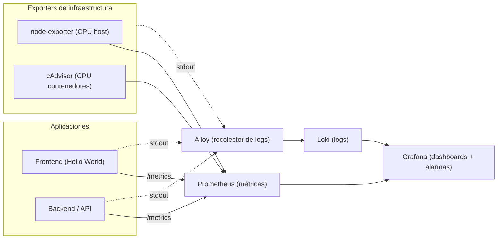

# Grafana, Prometheus y Loki

**Curso:** Infraestructura como Código
**Duración estimada:** 90–120 minutos
**Modalidad:** práctica individual o en parejas

---

## 1. Objetivos de aprendizaje

Al terminar este laboratorio serás capaz de:

1. Explicar el rol de cada componente de un stack de observabilidad (métricas, logs, visualización y recolección) y por qué se aprovisiona como código.
2. Levantar el stack completo con un único `docker compose up`, entendiendo qué provisiona cada servicio.
3. Construir un **dashboard** en Grafana que combine métricas de infraestructura y logs de aplicación e infraestructura.
4. Configurar una **alarma** que se dispare cuando el uso de CPU supere el 50% y verificar su funcionamiento.

---

## 2. Contexto: ¿por qué este stack?

En infraestructura como código no basta con *desplegar* servicios: también necesitamos *observarlos*, y esa observación debe ser reproducible. Por eso todo el stack de monitoreo se define en archivos versionables (`docker-compose.yml` y archivos de configuración) en lugar de configurarse a mano.

La observabilidad se apoya en dos señales distintas que requieren herramientas distintas:

- **Métricas** (números en el tiempo: % de CPU, memoria, peticiones por segundo). Las recolecta y almacena **Prometheus**. Los valores los exponen *exporters*: **node-exporter** (CPU/memoria del host) y **cAdvisor** (recursos por contenedor). Las aplicaciones también exponen sus propias métricas en `/metrics`.
- **Logs** (líneas de texto: eventos, errores, trazas). Prometheus *no* sirve para esto. Los almacena **Loki**, y quien recoge los logs de cada contenedor y se los envía es **Grafana Alloy** (el recolector que reemplazó a Promtail, en fin de vida desde marzo de 2026).

Finalmente, **Grafana** es la capa de visualización: se conecta tanto a Prometheus como a Loki, dibuja los dashboards y gestiona las alarmas.

> **Idea clave:** Prometheus = métricas, Loki = logs, Alloy = recolector de logs, Grafana = visualización + alarmas.

---

## 3. Arquitectura del laboratorio



Las aplicaciones (un frontend y un backend "Hello World") **ya están desplegadas** por el stack: emiten métricas en `/metrics` y escriben logs en formato JSON que Alloy recoge y envía a Loki.

---

## 4. Prerrequisitos

- **Docker** y **Docker Compose** instalados y funcionando (`docker --version`, `docker compose version`).
- Un navegador web.
- Los archivos del proyecto entregados por el docente (carpeta del laboratorio con su `docker-compose.yml`).
- Puertos libres en tu máquina: `3000`, `3001`, `3100`, `8080`, `8081`, `9090`, `9100`, `12345`.

---

## 5. Paso 1 — Levantar el stack

Desde la carpeta del proyecto:

```bash
docker compose up -d --build
```

Espera a que todos los contenedores estén arriba (la primera vez tarda más porque construye las apps y descarga imágenes). Verifica el estado:

```bash
docker compose ps
```

Comprueba en el navegador que responden los servicios principales:

| Servicio   | URL                       | Qué deberías ver                        |
|------------|---------------------------|-----------------------------------------|
| Frontend   | http://localhost:8080     | Página "Hello World" con dos botones    |
| Backend    | http://localhost:3001/metrics | Texto de métricas en formato Prometheus |
| Grafana    | http://localhost:3000     | Login (usuario `admin`, clave `admin`)  |
| Prometheus | http://localhost:9090     | Interfaz de Prometheus                   |

> Si algún servicio no responde, revisa la sección **9. Solución de problemas**.

---

## 6. Paso 2 — Generar tráfico y logs

Para tener datos que observar:

1. Abre el **frontend** en http://localhost:8080.
2. Pulsa varias veces el botón **"Saludar (API)"**. Cada pulsación genera una petición al backend, una métrica y varias líneas de log.
3. Deja la pestaña abierta unos minutos: las apps también emiten logs simulados de actividad (pedidos, pagos, advertencias y errores) de forma periódica.

El botón de carga de CPU lo usaremos al probar la alarma.

---

## 7. Paso 3 — Verificar las fuentes de datos en Grafana

Las fuentes de datos ya están **aprovisionadas como código**, así que no hay que crearlas a mano.

1. Entra a Grafana (http://localhost:3000) con `admin` / `admin`.
2. Ve a **Connections → Data sources**.
3. Confirma que existen **Prometheus** y **Loki**, ambos en estado correcto (puedes usar el botón *Test* / *Save & test*).

> ¿Por qué ya están ahí? Porque se definieron en un archivo de provisioning que Grafana lee al arrancar. Eso es infraestructura como código: la configuración no depende de que alguien recuerde hacer clic.

---

## 8. Paso 4 — Construir el dashboard

Crea un nuevo dashboard: **Dashboards → New → New dashboard → Add visualization**.

### 8.1 Panel: CPU del contenedor de la aplicación

1. Selecciona la fuente de datos **Prometheus**.
2. En el editor de consulta, escribe esta expresión PromQL:

   ```
   sum(rate(container_cpu_usage_seconds_total{name="lab-backend"}[1m])) * 100
   ```

   Devuelve el % de CPU que consume el contenedor del backend (100 ≈ un núcleo completo).
3. Tipo de visualización: **Time series**.
4. En **Standard options → Unit**, elige **Percent (0–100)**.
5. (Recomendado) En **Thresholds**, añade un umbral en `50` con color rojo: así verás visualmente cuándo se cruza el límite.
6. Título del panel: *"CPU contenedor backend (%)"*. Guarda con **Apply**.

### 8.2 Panel: CPU del host (infraestructura)

Crea otro panel con fuente **Prometheus** y la consulta:

```
100 - (avg(rate(node_cpu_seconds_total{mode="idle"}[1m])) * 100)
```

Unidad **Percent (0–100)**, título *"CPU del host (%)"*. Este panel representa la métrica de infraestructura general (la máquina), frente al panel anterior que es por contenedor.

### 8.3 Panel: Logs de aplicación (API + frontend)

1. Crea un panel nuevo y selecciona la fuente **Loki**.
2. Cambia el tipo de visualización a **Logs**.
3. En el editor, usa el filtro por etiqueta:

   ```
   {tier="application"} | json
   ```

   - `tier="application"` trae solo los logs del backend y del frontend.
   - `| json` parsea los campos del log (level, service, msg, etc.) para poder filtrarlos.
4. Prueba a filtrar por nivel; por ejemplo, solo errores:

   ```
   {tier="application"} | json | level="ERROR"
   ```
5. Título: *"Logs de aplicación (API + frontend)"*.

### 8.4 Panel: Logs de infraestructura

Repite con fuente **Loki**, tipo **Logs**, y la consulta:

```
{tier="infrastructure"}
```

Esto muestra los logs de los componentes del stack (Prometheus, Loki, Grafana, exporters…). Título: *"Logs de infraestructura"*.

### 8.5 Guardar

Pulsa **Save dashboard** (arriba a la derecha) y ponle un nombre, por ejemplo *"Observabilidad — \<tu nombre\>"*.

> En este punto tu dashboard ya distingue métricas de contenedor vs host y logs de aplicación vs infraestructura. Ese es el entregable de visualización.

---

## 9. Paso 5 — Configurar la alarma de CPU > 50%

Usaremos las **alarmas de Grafana** (Grafana Alerting).

1. Ve a **Alerting → Alert rules → New alert rule**.
2. **Nombre:** `CPU backend > 50%`.
3. **Define query and alert condition:**
   - Query **A**, fuente **Prometheus**:
     ```
     sum(rate(container_cpu_usage_seconds_total{name="lab-backend"}[1m])) * 100
     ```
   - En la sección de condición, Grafana añade por defecto una expresión **Reduce** (función `Last`) y una expresión **Threshold**. En el **Threshold**, configura **IS ABOVE `50`**. Esa es la condición de alerta.
4. **Evaluation behavior:**
   - Crea (o elige) una carpeta y un *evaluation group* con intervalo de evaluación de `10s`.
   - **Pending period:** `30s` (la métrica debe mantenerse sobre 50% durante 30s antes de pasar a *Firing*; evita falsas alarmas por picos cortos).
5. **Configure labels and notifications:**
   - Añade una etiqueta `severity = warning`.
   - Como **contact point**, puedes dejar el `grafana-default-email` para esta práctica: bastará con ver el cambio de estado a *Firing*.
6. Guarda con **Save rule and exit**.

---

## 10. Paso 6 — Probar la alarma

1. En el frontend (http://localhost:8080) pulsa **"Generar carga de CPU (30s)"**.
   *(Alternativa por terminal: `curl "http://localhost:3001/load?seconds=60"`.)*
2. Observa el **panel de CPU del backend**: debe subir y superar el 50%.
3. Ve a **Alerting → Alert rules** y observa cómo la regla pasa de `Normal` → `Pending` → `Firing`.
4. Cuando termine la carga, la métrica baja y la alarma vuelve a `Normal`.

Toma una captura del estado **Firing** y del panel con la CPU por encima de 50%: es parte del entregable.

---

## 11. Cerrar el ciclo: alarma → log

Configura un **contact point** de tipo **Webhook** apuntando a `http://backend:3001/alerts`. Cuando la alarma se dispare, el backend registrará un log de la alerta, que volverá a aparecer en tu panel **"Logs de infraestructura"**. Así visualizas el recorrido completo: una métrica cruza un umbral → se genera una alarma → la alarma produce un log → el log se observa en el dashboard.

---

## 12. Entregables y criterios de evaluación

| Criterio | Puntos |
|---|---|
| Stack levantado y todos los servicios accesibles | 2 |
| Dashboard con panel de CPU por contenedor (con umbral en 50%) | 5 |
| Dashboard con panel de CPU del host | 3 |
| Panel de logs de aplicación funcionando (filtro por nivel) | 2 |
| Panel de logs de infraestructura funcionando | 2 |
| Alarma de CPU > 50% configurada correctamente | 2 |
| Evidencia de la alarma en estado *Firing* tras generar carga | 2 |
| Ciclo cerrado alarma → log vía webhook | 2 |
| **Total** | **20** |

Entrega: capturas de pantalla del dashboard y de la alarma en *Firing*, más una breve explicación (5–8 líneas) de qué hace cada componente del stack.

---

## 13. Preguntas a responder

1. ¿Por qué necesitamos Loki además de Prometheus si ya tenemos `/metrics`?
2. ¿Qué ventaja aporta que las fuentes de datos de Grafana estén aprovisionadas como código y no creadas a mano?
3. El panel "CPU contenedor" y el panel "CPU host" pueden mostrar valores muy distintos. ¿Por qué? ¿Cuál usarías para alertar sobre una aplicación concreta?
4. ¿Qué diferencia hay entre el *evaluation interval* y el *pending period* de una alarma?

---

## 14. Solución de problemas

- **Un servicio no levanta:** mira sus logs con `docker compose logs <servicio>` (por ejemplo `docker compose logs grafana`).
- **No aparecen métricas en Prometheus:** entra a http://localhost:9090/targets y verifica que todos los *targets* estén `UP`.
- **No aparecen logs en Loki:** revisa el estado de Alloy en http://localhost:12345 y que el contenedor tenga acceso al socket de Docker.
- **La alarma no se dispara:** confirma que la consulta usa `name="lab-backend"` (el nombre exacto del contenedor) y que realmente generaste carga.
- **Empezar de cero:** `docker compose down -v` borra datos, dashboards y alarmas creados.

---

## 15. Comandos útiles

```bash
docker compose up -d --build     # levantar / reconstruir
docker compose ps                # estado de los servicios
docker compose logs -f grafana   # seguir logs de un servicio
docker compose down              # detener (conserva dashboards)
docker compose down -v           # detener y borrar todos los datos
```
